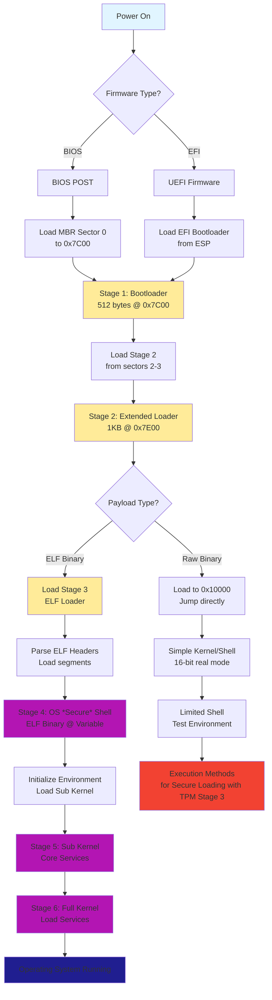

# NaoBootloader Architecture

## Overview

The NaoBootloader implements a multi-stage boot process supporting both BIOS and EFI systems. Each stage progressively loads more complex components until the full operating system is running.

---

## Boot Modes

### BIOS (Legacy Boot)
- Traditional PC BIOS firmware
- 16-bit real mode initialization
- Loads from MBR (Master Boot Record)
- Limited to 1MB initial memory access

### EFI (Modern Boot)
- Unified Extensible Firmware Interface
- Boots in protected/long mode with UEFI services
- Loads from GPT (GUID Partition Table)
- Full memory access and modern firmware services

---

## Boot Stages

### Stage 1: First Stage Bootloader
**Location:** MBR sector 0 (BIOS) or EFI System Partition (EFI)  
**Size:** 512 bytes (BIOS), Variable (EFI)  
**Address:** 0x7C00 (BIOS), Loaded by firmware (EFI)

**Responsibilities:**
- Initialize CPU and basic hardware
- Set up initial segment registers
- Detect boot drive
- Load Stage 2 bootloader from disk
- Transfer control to Stage 2

**Current Implementation:** [`bootloader.asm`](bootloader.asm)
- Loaded by BIOS at 0x7C00
- Reads 2 sectors (1KB) from disk starting at sector 3
- Loads Stage 2 to 0x7E00
- Passes boot drive info via DL register

---

### Stage 2: Extended Bootloader
**Location:** Sectors 2-3 (starting at sector 3 in BIOS numbering)  
**Size:** 1 KB (2 sectors)  
**Address:** 0x7E00

**Responsibilities:**
- Extended disk I/O capabilities
- Load larger payload (kernel/Stage 3)
- Basic environment setup
- Optional: ELF parsing and loading
- Transfer control to Stage 3 or kernel

**Current Implementation:** [`stage2.asm`](stage2.asm)
- Loads up to 80 sectors (40KB) from disk starting at sector 5
- Loads payload to physical address 0x10000 (0x1000:0x0000)
- **Note:** Currently does raw binary loading, not ELF-aware

---

### Stage 3: ELF Loader & Environment Setup
**Location:** Loaded by Stage 2  
**Size:** Variable (~4-8 KB typical)  
**Address:** 0x10000+

**Responsibilities:**
- Parse ELF binary format
- Load ELF segments to correct memory locations
- Set up Global Descriptor Table (GDT) for protected mode
- Configure interrupt handlers
- Initialize memory management
- Load and execute OSShell

**Planned Features:**
- ELF32/ELF64 parser
- Relocation support
- Dynamic linking setup
- Protected mode transition

---

### Stage 4: OSShell (Operating System Shell)
**Location:** Loaded as ELF binary by Stage 3  
**Size:** Variable (~39KB current)  
**Address:** Determined by ELF program headers

**Responsibilities:**
- Interactive command-line interface
- File system initialization (basic)
- Device driver loading
- Memory manager initialization
- Process/task structure setup
- Load sub-kernel modules

**Current Status:** 
- OSShell exists as ELF binary ([`osshell.bin`](osshell.bin))
- Requires ELF loader in Stage 2/3 to function properly

---

### Stage 5: Sub Kernel
**Location:** Loaded by OSShell  
**Size:** Variable  

**Responsibilities:**
- Core kernel initialization
- Full memory management (paging, virtual memory)
- Process scheduler
- System call interface
- Device driver framework
- Inter-process communication (IPC)

---

### Stage 6: Full Kernel & Services
**Location:** Loaded by Sub Kernel  

**Responsibilities:**
- Complete operating system functionality
- User space initialization
- System services and daemons
- Network stack
- File systems
- User interface

---

## Boot Flow Diagram



---

## Memory Layout

```
0x00000000 - 0x000003FF : Real Mode IVT (Interrupt Vector Table)
0x00000400 - 0x000004FF : BIOS Data Area
0x00000500 - 0x00007BFF : Free conventional memory
0x00007C00 - 0x00007DFF : Stage 1 Bootloader (512 bytes)
0x00007E00 - 0x00007FFF : Stage 2 Loader (512 bytes)
0x00008000 - 0x00009FFF : Stack space
0x0000A000 - 0x0000FFFF : Free for Stage 2 use
0x00010000 - 0x0001FFFF : Stage 3/OSShell loaded here (64KB)
0x00020000 - 0x0007FFFF : Kernel/Extended memory
0x00080000 - 0x0009FFFF : Extended BIOS Data Area (EBDA)
0x000A0000 - 0x000FFFFF : Video memory & ROM
0x00100000+             : Extended memory (1MB+)
```

---

## Disk Layout

### BIOS Boot Disk

```
Sector 0:       Stage 1 Bootloader (512 bytes)
Sector 1:       [Reserved]
Sectors 2-3:    Stage 2 Loader (1KB)
Sectors 4+:     Kernel/OSShell payload (up to 40KB with current loader)
```

### EFI Boot Disk

```
GPT Header
EFI System Partition (FAT32)
  └── /EFI/BOOT/BOOTX64.EFI    (Stage 1 EFI loader)
  └── /stage2.bin               (Stage 2 loader)
  └── /osshell.elf              (OSShell ELF binary)
Data Partitions
```

---

## Current Implementation Status

| Stage | Status | Notes |
|-------|--------|-------|
| Stage 1 (BIOS) | ✅ Complete | Working bootloader @ 0x7C00 |
| Stage 2 | ✅ Functional | Loads 80 sectors, no ELF support yet |
| Stage 3 (ELF Loader) | ⚠️ Missing | **Needs implementation** |
| Stage 4 (OSShell) | ⚠️ Blocked | ELF binary exists but can't load |
| Stage 5 (Sub Kernel) | ❌ Not started | - |
| Stage 6 (Full Kernel) | ❌ Not started | - |
| EFI Support | ❌ Not started | - |

---

## Next Steps

1. **Implement ELF Loader** (Stage 3)
   - Parse ELF32 headers
   - Load program segments to correct addresses
   - Handle relocations
   - Jump to entry point

2. **Convert OSShell or Add ELF Support**
   - Option A: Convert osshell.bin to flat binary: `objcopy -O binary osshell.bin osshell_flat.bin`
   - Option B: Enhance Stage 2 with ELF parsing capabilities

3. **Protected Mode Transition**
   - Set up GDT
   - Switch to 32-bit protected mode
   - Enable A20 line

4. **Memory Management**
   - Detect available memory
   - Set up basic allocator
   - Page table initialization

5. **EFI Support**
   - Create UEFI bootloader
   - Utilize UEFI services
   - Hybrid BIOS/EFI support
```